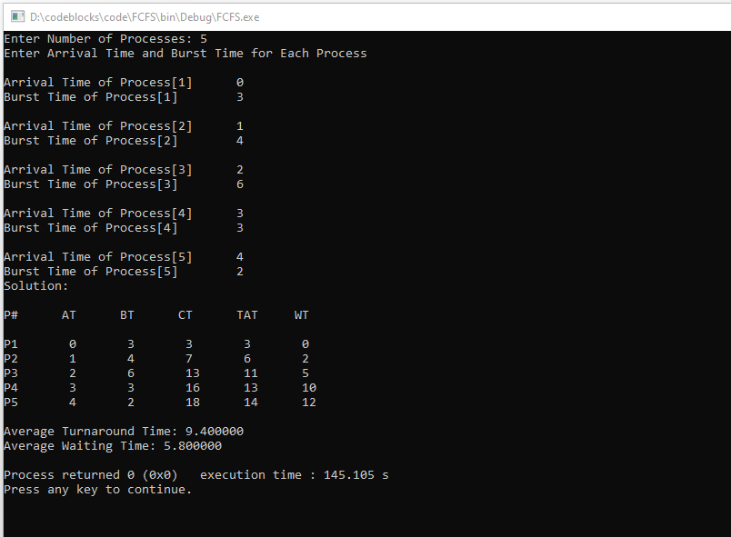
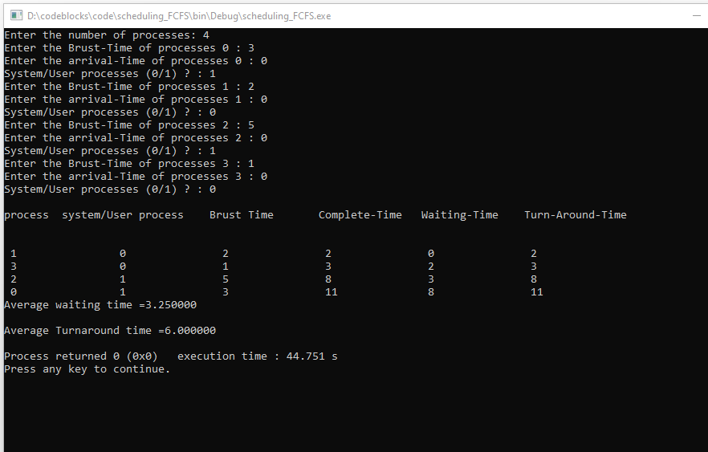

# Output

---
<h1>Green University of Bangladesh </h1>

<h2>Dept. of Computer Science Engineering</h2>

Course Title: Operating System Lab

Course Code: CSE-310

Include all C Language file

---

Lab Report: Program for First Come First Serve  (FCFS) Algorithm

---

---

<h1 id="test-title">Lab Report in PDF</h1>

<object data="loremipsum.pdf#page=2" type="application/pdf" width="700px" height="700px">
    <embed src="loremipsum.pdf#page=2">
        
Click here for Lab Report: <a href="Lab_Report_02.pdf">Download PDF</a>.

    </embed>
</object>

---

Lab Report: Write a C program to multi-level queue scheduling algorithm Using FCFS

---

---

<h1 id="test-title">Lab Report in PDF</h1>

<object data="loremipsum.pdf#page=2" type="application/pdf" width="700px" height="700px">
    <embed src="loremipsum.pdf#page=2">
        
Click here for Lab Report: <a href="Lab_Report_03.pdf">Download PDF</a>.

    </embed>
</object>

<!-- all link is here -->

### Contact me:

[E-mail]( tanvirpoly@gmail.com)

[Linkedin]( https://www.linkedin.com/in/tanvirx/)

[Facebook]( https://www.facebook.com/tanvirfbid)

